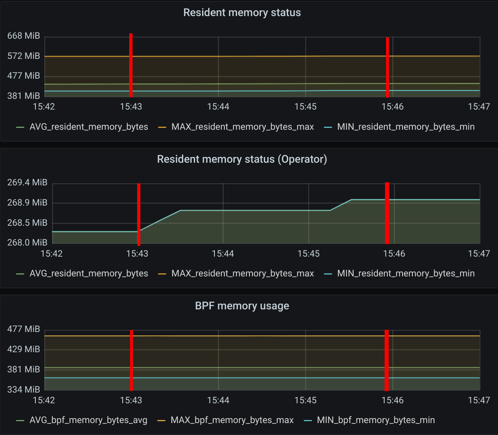
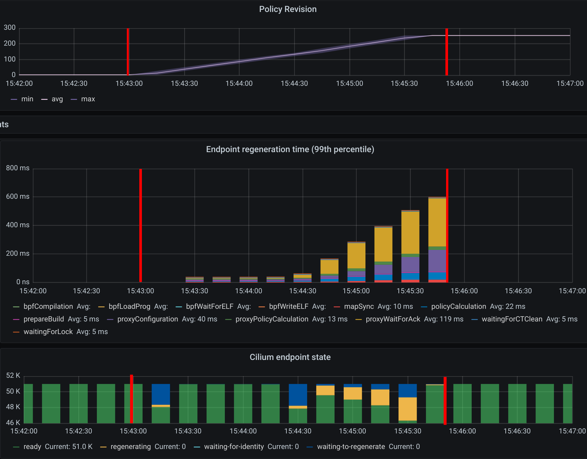
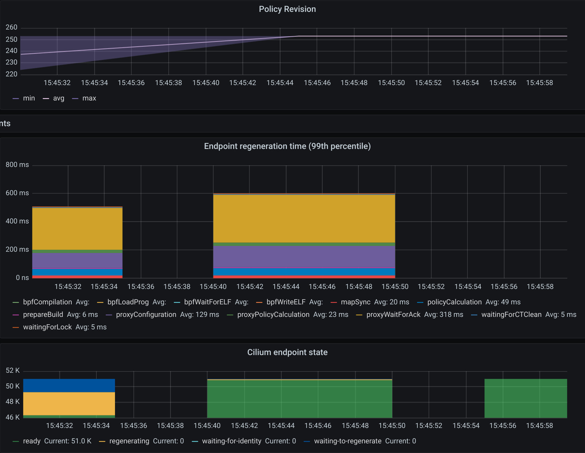
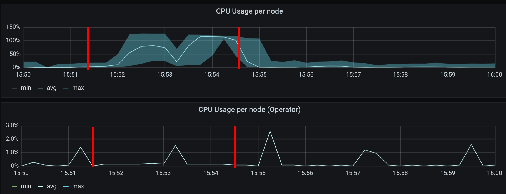

.. only:: not (epub or latex or html)

    WARNING: You are looking at unreleased Cilium documentation.
    Please use the official rendered version released here:
    https://docs.cilium.io

.. _scalability_guide:

*****************
Scalability guide
*****************

This guide is intended for users planning to run Cilium on clusters with more
than 200 nodes in CRD mode (without a kvstore available). In our development
cycle we have deployed Cilium on large clusters and these were the options that
were suitable for our testing:

=====
Setup
=====

.. parsed-literal::
 helm template cilium \\
     --namespace kube-system \\
     --set global.endpointHealthChecking.enabled=false \\
     --set global.healthChecking.enabled=false \\
     --set global.ipam.mode=kubernetes \\
     --set global.k8sServiceHost=<KUBE-APISERVER-LB-IP-ADDRESS> \\
     --set global.k8sServicePort=<KUBE-APISERVER-LB-PORT-NUMBER> \\
     --set global.prometheus.enabled=true \\
     --set global.operatorPrometheus.enabled=true \\
   > cilium.yaml

* ``--set global.endpointHealthChecking.enabled=false`` and
  ``--set global.healthChecking.enabled=false``: disables endpoint health
  checking entirely. However it is recommended that those features should be
  enabled initially on a smaller cluster (3-10 nodes) where it can be used to
  detect potential packet loss due firewall rules or hypervisor settings.

* ``--set global.ipam.mode=kubernetes``: is set to ``"kubernetes"`` since our
  cloud provider has pod CIDR allocation enabled in ``kube-controller-manager``.

* ``--set global.k8sServiceHost`` and ``--set global.k8sServicePort`` were set
  with the IP address of the loadbalancer that was in front of ``kube-apiserver``.
  This allows Cilium to not depend on kube-proxy to connect to ``kube-apiserver``.

* ``--set global.prometheus.enabled=true`` and
  ``--set global.operatorPrometheus.enabled=true``: They were just set since we
  had a Prometheus server probing for metrics in the entire cluster.

Our testing cluster consisted of 3 controller nodes and 1000 worker nodes.
We have followed the recommended settings from the
`official Kubernetes documentation <https://kubernetes.io/docs/setup/best-practices/cluster-large/>`_
documentation and we have provisioned our machines with the following settings:

* **Cloud provider**: Google Cloud

* **Controllers**: 3x n1-standard-32 (32vCPU, 120GB memory and 50GB SSD, kernel 5.4.0-1009-gcp)

* **Workers**: 1 pool of 1000x custom-2-4096 (2vCPU, 4GB memory and 10GB HDD, kernel 5.4.0-1009-gcp)

* **Metrics**: 1x n1-standard-32 (32vCPU, 120GB memory and 10GB HDD + 500GB HDD)
  this is a dedicated node for prometheus and grafana pods.

.. note::

    All 3 controller nodes were behind a GCE Loadbalancer.

    Each controller contained an ``etcd``, ``kube-apiserver``,
    ``kube-controller-manager`` and ``kube-scheduler`` instances.

    The CPU, memory and disk size set for the workers might be different for
    your use case, you might have pods that require more memory or CPU available
    so you should design your workers based on your requirements.

    During our testing we had to set the ``etcd`` option
    ``quota-backend-bytes=17179869184`` as ``etcd`` failed once it reached around
    ``2GiB`` of allocated space.

    Since Cilium is capable to perform all functionalities provided by
    ``kube-proxy`` we have provisioned our workers nodes without ``kube-proxy``.
    Thus, as we are not running with ``kube-proxy`` enabled, Cilium cannot use
    the service IP address of ``kube-apiserver``, so we had to set the IP address
    of the LB in front of kube-apiserver with the options
    ``--set global.k8sServiceHost=<KUBE-APISERVER-LB-IP-ADDRESS>``
    and ``--set global.k8sServicePort=<KUBE-APISERVER-LB-PORT-NUMBER>``.

    Our ``DaemonSet`` ``updateStrategy`` had the ``maxUnavailable`` set to 250
    pods instead of 2, but this value highly depends on your requirements when
    you are performing a rolling update of Cilium:

=====
Steps
=====

For our testing we have performed the following tasks and for each step we
provide more details of our findings and expected behavior:

^^^^^^^^^^^^^^^^^^^^^^^^^^^^^^^^^^^^^^^^^^^^^^^^^^^^^^^^^^^^^^^^
1. Install Kubernetes v1.18.3 with EndpointSlice feature enabled
^^^^^^^^^^^^^^^^^^^^^^^^^^^^^^^^^^^^^^^^^^^^^^^^^^^^^^^^^^^^^^^^

To test the most up to date functionalities from Kubernetes and Cilium, we have
performed our testing with Kubernetes v1.18.3 and the EndpointSlice feature
enabled which provides a better scalability;

Since Kubernetes requires an ``etcd`` cluster, we have deployed v3.4.9.

^^^^^^^^^^^^^^^^^^^^^^^^^^^^^^^^^^^^^^^^
2. Deploy Prometheus, Grafana and Cilium
^^^^^^^^^^^^^^^^^^^^^^^^^^^^^^^^^^^^^^^^

We have used prometheus v2.18.1 and grafana v7.0.1 to retrieve and analyze
``etcd``, ``kube-apiserver``, ``cilium`` and ``cilium-operator`` metrics;

^^^^^^^^^^^^^^^^^^^^^^^^^^^^
3. Provision 2 workers nodes
^^^^^^^^^^^^^^^^^^^^^^^^^^^^

This helped us to understand if our testing cluster was correctly provisioned
and all metrics were being gathered.

^^^^^^^^^^^^^^^^^^^^^^^^^^^^^^^^^^^^^^^^^^^^^^^^^^^^^^^^^^^^
4. Deploy 5 namespaces with 25 deployments on each namespace
^^^^^^^^^^^^^^^^^^^^^^^^^^^^^^^^^^^^^^^^^^^^^^^^^^^^^^^^^^^^

* Each deployment had 1 replica each (125 pods in total).

* To measure the resources **only** consumed by Cilium, all deployments used
  the same base image ``k8s.gcr.io/pause:3.2``.

* Since we provision a small number of pods in our small cluster we are able to
  understand the CPU usage of Cilium when a small number of pods is provisioned:

The mark shows when the creation of 125 pods have started.
As expected, we can see a slight increase of the CPU usage on both
cilium-agents running and in the cilium operator. The Cilium agents
peaked at 6.8% CPU usage on a 2vCPU machine.

.. figure:: images/image_4_02.png

For the memory usage we have not seen a significant memory growth in the
Cilium agent. On the BPF memory side we do see it increasing due the
initialization of some BPF maps for the pods that we have started.

^^^^^^^^^^^^^^^^^^^^^^^^^^^^^^^^^^^^^^^^^^^^^
5. Provision 998 new nodes (total 1000 nodes)
^^^^^^^^^^^^^^^^^^^^^^^^^^^^^^^^^^^^^^^^^^^^^

.. figure:: images/image_5_01.png

The first mark represents the action of creating nodes, the second mark
represents when 1000 Cilium pods were in ready state. It is expected that the
CPU usage of Cilium increases since each Cilium agent receives events from
Kubernetes whenever a new node is provisioned in the cluster. Once all nodes
were deployed the average CPU usage was on average 0.15% on a 2vCPU node.

.. figure:: images/image_5_02.png

As we have increased the number of nodes in the cluster to 1000 it is expected
to see a small growth of the memory usage in all metrics. However, it is
relevant to point out that **the number of nodes does not have a significant
growth in Cilium’s memory consumption in both control and dataplane.**

^^^^^^^^^^^^^^^^^^^^^^^^^^^^^^^^^^^^^^^^^^^^^^^
6. Deploy 25 more deployments on each namespace
^^^^^^^^^^^^^^^^^^^^^^^^^^^^^^^^^^^^^^^^^^^^^^^

This will now bring us a total of
``5 namespaces * (25 old deployments + 25 new deployments)=250`` deployments in
the entire cluster.
We did not install 250 deployments from the start since we only had 2 nodes and
that would create 125 pods on each worker node and accordingly with the
Kubernetes documentation the maximum recommended number of pods per node is 100.

^^^^^^^^^^^^^^^^^^^^^^^^^^^^^^^^^^^^^^^^^^^^^^^^^^^^^^^^^^^^^^
7. Scale each deployment to 200 replicas (50000 pods in total)
^^^^^^^^^^^^^^^^^^^^^^^^^^^^^^^^^^^^^^^^^^^^^^^^^^^^^^^^^^^^^^

Having 5 namespaces with 50 deployments means that we have 250 different unique
security identities. Having a low cardinality in the labels selected by Cilium
helps the scalability of security identities in the cluster. By default, Cilium
has a limit of 16k security identities, however this limit can be incremented by
the user with ``bpf-policy-map-max`` in the Cilium ``ConfigMap``.

The first mark represents the action of scaling up the deployments, the second
mark represents when 50000 pods were in ready state.

* It is expected to see the CPU usage of Cilium increasing since each Cilium
  agent receives events from Kubernetes when a new pod is scheduled and started
  in the node where that Cilium pod is running.

* The average CPU consumption of all Cilium agents was 3.38% on a 2vCPU machine.
  At one given point, roughly around minute 15:23, one of those Cilium agents
  picked 27.94% CPU usage.

* Cilium Operator had a stable 5% CPU consumption while the pods were being
  created.

.. figure:: images/image_7_02.png

Similar to the behavior seen with the growth number of nodes, increasing pods
also increases Cilium memory consumption.

* As we increased the number of pods from 250 to 50000 we saw a max memory usage
  of 573MiB for one of the Cilium agents while the average was 438 MiB.
* For the BPF memory usage we saw a max usage of 462.7MiB
* This means that each **Cilium agent memory increases 10.5KiB per pod created
  in the cluster.**

^^^^^^^^^^^^^^^^^^^^^^^^^^^^^^^^^^^^^^
8. Deploy 250 policies for 1 namespace
^^^^^^^^^^^^^^^^^^^^^^^^^^^^^^^^^^^^^^

Here we have created 125 L4 network policies and 125 L7 policies. Each policy
selected all pods on this namespace and was allowed to send traffic to another
pod on this namespace. Each 250 policies differ on the chosen port. In the end
we will have 250 different policies selecting 10000 pods.

::

    apiVersion: "cilium.io/v2"
    kind: CiliumNetworkPolicy
    metadata:
      name: "l4-rule-#"
      namespace: "namespace-1"
    spec:
      endpointSelector:
        matchLabels:
          my-label: testing
      fromEndpoints:
        matchLabels:
          my-label: testing
      egress:
        - toPorts:
          - ports:
            - port: "[0-125]+80" // from 80 to 12580
              protocol: TCP
    ---
    apiVersion: "cilium.io/v2"
    kind: CiliumNetworkPolicy
    metadata:
      name: "l7-rule-#"
      namespace: "namespace-1"
    spec:
      endpointSelector:
        matchLabels:
          my-label: testing
      fromEndpoints:
        matchLabels:
          my-label: testing
      ingress:
      - toPorts:
        - ports:
          - port: '[126-250]+80' // from 12680 to 25080
            protocol: TCP
          rules:
            http:
            - method: GET
              path: "/path1$"
            - method: PUT
              path: "/path2$"
              headers:
              - 'X-My-Header: true'

In this case we saw one of the Cilium agents jumping to 100% CPU usage for 15
seconds while the average peak was 40% during a period of 90 seconds.

As expected, **increasing the number of policies does not have a significant
impact in the memory usage of Cilium since the BPF policy maps have a constant
size** once a pod is initialized.

The first mark represents the point in time when we ran ``kubectl create`` to
create the ``CiliumNetworkPolicies``. Since we created 250 policies sequentially
we cannot correctly derive the time between the creation of the 250th CNP and
the time the last endpoint had its policy enforced. In our examples we have
used 250 different CNP objects, to correctly measure the convergence time we
could have used a single CNP with multiple policy rules defined under the
``specs`` field (not ``spec``) for a CNP.

However we can see the time it took the last Cilium agent to increment its
Policy Revision, which is incremented individually on each Cilium agent every
time time a CiliumNetworkPolicy (CNP) is received, between second ``15:45:44``
and ``15:45:46`` and see when was the last time an Endpoint was regenerated by
checking the 99th percentile of the "Endpoint regeneration time", we can see
that it took less than 5s. We can also verify **the maximum time was less than
``600ms`` for an endpoint to have the policy enforced.**

^^^^^^^^^^^^^^^^^^^^^^^^^^^^^^^^^^^^^^^^^^^^^^^^^^^^^^^^^^^^^^^^^^
9. Deploy 250 policies for CiliumClusterwideNetworkPolicies (CCNP)
^^^^^^^^^^^^^^^^^^^^^^^^^^^^^^^^^^^^^^^^^^^^^^^^^^^^^^^^^^^^^^^^^^

The difference between these policies and the previous ones installed is that
these ones select all pods in all namespaces. To recap, this means that we will
now have **250 different network policies selecting 10000 pods and 250 different
network policies selecting 50000 pods on a cluster with 1000 nodes.** Similarly
to the previous step we will deploy 125 L4 policies and another 125 L7 policies.

.. figure:: images/image_9_02.png

Similar to the creation of the previous 250 CNPs, there was also an increase in
CPU usage during the creation of the CCNPs. The CPU usage was similar even
though the policies were effectively selecting more pods.

As all pods running in a node are selected by **all the 250 CCNPs created**, we
see an increase of the **Endpoint regeneration time** which **peaked a little
above 3s.**

^^^^^^^^^^^^^^^^^^^^^^^^^^^^^^^^^^^^^
10. "Accidentally" destroy 10000 pods
^^^^^^^^^^^^^^^^^^^^^^^^^^^^^^^^^^^^^

In this step we have "accidentally" destroyed 10000 random pods. Kubernetes will
then recreate 10000 new pods so it will help us understand what is the
convergence time for all the network policies deployed.

.. figure:: images/image_10_02.png

* The first mark represents the point in time when pods were "deleted" and the
  second mark represents the point in time 10k new pods finished to be
  recreated.

* Besides the CPU usage slightly increasing while pods are being scheduled in
  the cluster we did see some interesting data points in the BPF memory usage.
  As each endpoint can have one or more dedicated BPF maps, the BPF memory usage
  is directly correlated with the number of pods running in a node. **If the
  number of pods per node decreases so does the BPF memory usage.**

.. figure:: images/image_10_03.png

Another interesting data point is the Endpoint regeneration time is "inexistent".
Unfortunately, we were not able figure out why the metric was not available for
this time period. Luckily enough we had another metric that was showing how
many Cilium endpoints had policy being enforced:

.. figure:: images/image_10_04.png

^^^^^^^^^^^^^^^^^^^^^^^^^^^^^^^^^^^^^^^^^^^
11. Control plane metrics over the test run
^^^^^^^^^^^^^^^^^^^^^^^^^^^^^^^^^^^^^^^^^^^

The focus of this test was to study the Cilium agent resource consumption at
scale. However we also monitored some metrics of the control plane nodes such as
etcd metrics and CPU usage of the k8s-controllers and we present them in the
next figures.

.. figure:: images/image_11_01.png

Memory consumption of the 3 etcd instances during the entire scalability
testing.

CPU Usage for the 3 controller nodes, average latency per request type in
the etcd cluster as well as the number of operations per second made to etcd.

.. figure:: images/image_11_03.png

All etcd metrics, from left to right, from top to bottom: database size,
disk sync Duration, client traffic in, client traffic out, peer traffic in,
peer traffic out.

=============
Final Remarks
=============

With this test we were able to have a better understanding of Cilium running
in a large cluster entirely in CRD mode and without depending on etcd. There is
still some work to be done with regarding the memory footprint of BPF maps which
can be optimized even further as well as the memory footprint of the Cilium
agent which we will address in the next Cilium version.

We can also determine that it is scalable to run Cilium in CRD mode on a cluster
with more than 200 nodes. However it is worth to point out that more tests will
need to be done in order to verify the behavior of Cilium when it loses the
connectivity with kube-apiserver, in a case of an upgrade of the control plane
for example. This will also be our focus in the next Cilium version.
